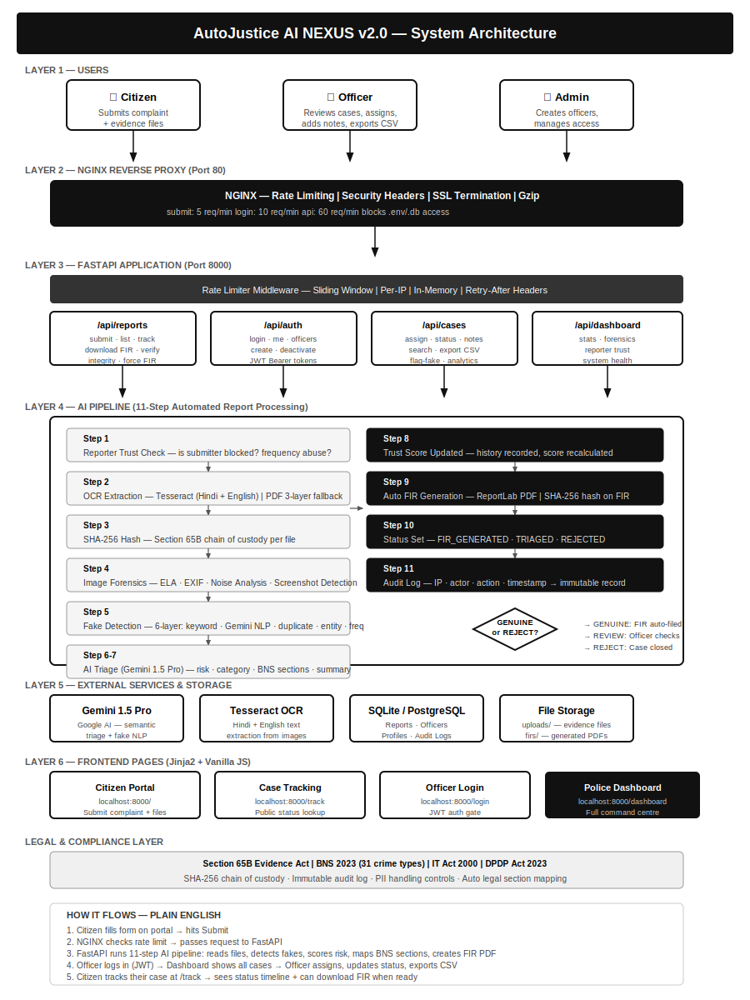

# AutoJustice AI NEXUS
### AI-Driven Digital Forensics & Automated Threat Triage Platform


---

## Overview
AutoJustice AI NEXUS is an end-to-end cybercrime complaint management platform that automates digital forensics, fake report detection, and legal section mapping using a multi-layered AI pipeline — compliant with DPDP Act 2023 and BNS 2023.

---

## AI Pipeline

```
Citizen Upload
     ↓
OCR Extraction (Tesseract)
     ↓
SHA-256 Hash (Section 65B)
     ↓
6-Layer Fake Detection
  L1: Keyword density analysis
  L2: Gemini 1.5 narrative coherence
  L3: Evidence-description correlation
  L4: Entity consistency validation
  L5: Duplicate fingerprint detection
  L6: Behavioral anomaly scoring
     ↓
AI Semantic Triage + ML Models
  → Risk Level: HIGH / MEDIUM / LOW
  → Crime Category + BNS/IPC section mapping
  → Entity extraction (victim, suspect, financial)
     ↓
Complaint Generation (PDF)
  → Legally structured document
  → Section 65B certificate
  → SHA-256 integrity hash
     ↓
Police Dashboard Alert
```

---

## Key Features
- **Identity Verification** — Aadhaar-linked via DigiLocker OAuth 2.0 + OTP
- **Fake Report Detection** — 6-layer AI combining LLM prompting, RandomForest ML, and image forensics (ELA, AI-generation detection)
- **Legal Mapping** — Auto-maps complaints to BNS 2023 sections
- **Audit Trail** — Immutable SHA-256 chain-of-custody logs
- **DPDP Act 2023 Compliant**

---

## Tech Stack
| Layer | Technology |
|---|---|
| Backend | FastAPI, Python |
| AI/ML | Gemini 1.5 Pro, Scikit-learn, RandomForest |
| OCR | Tesseract |
| Auth | DigiLocker OAuth 2.0, OTP verification |
| Deployment | Docker, Docker Compose, Nginx |
| Database | PostgreSQL |

---

## Setup

```bash
git clone https://github.com/aadya-jain-27/AutoJustice-AI-NEXUS.git
cd AutoJustice-AI-NEXUS
cp .env.example .env
# Add your API keys to .env
docker-compose up --build
```

---

## Architecture

